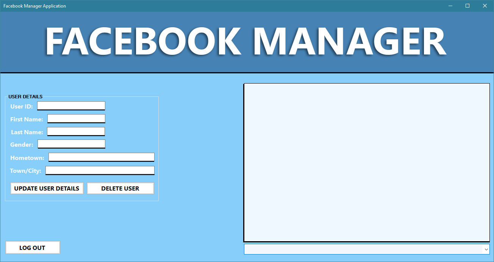
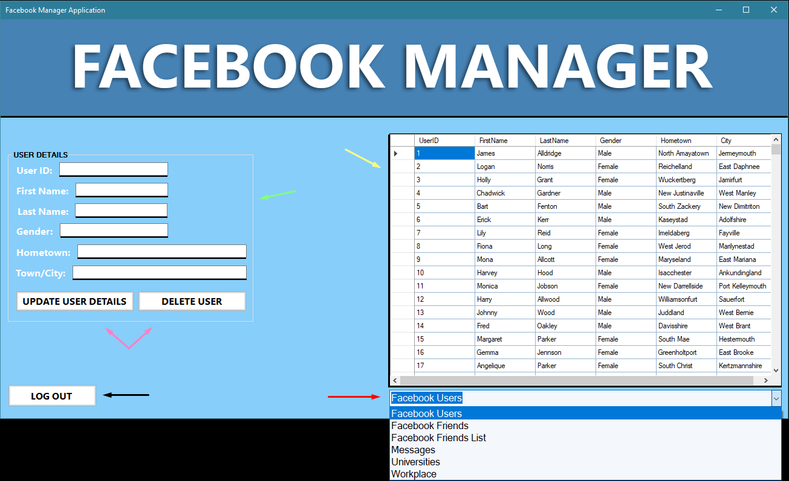
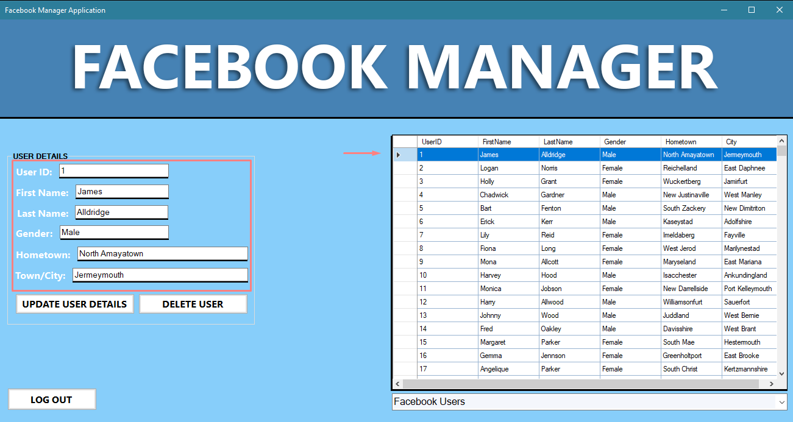
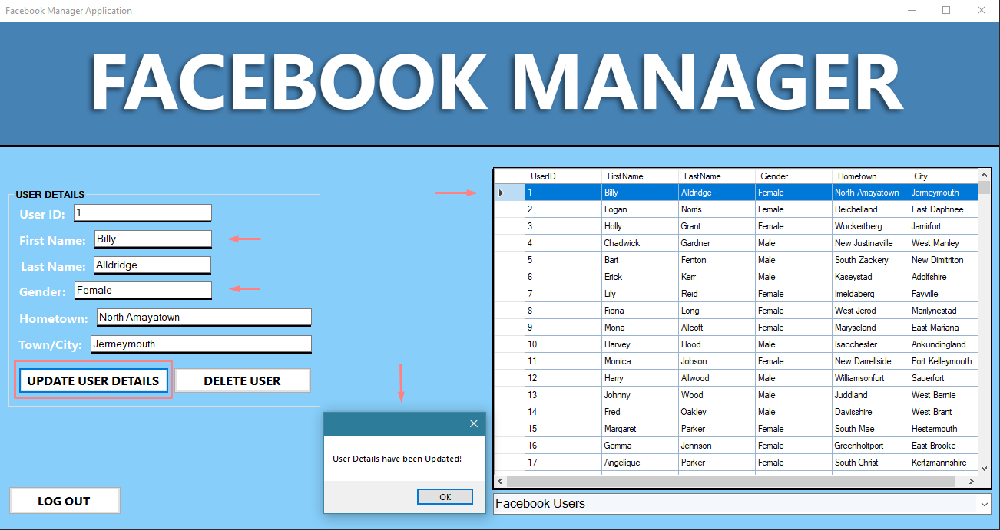
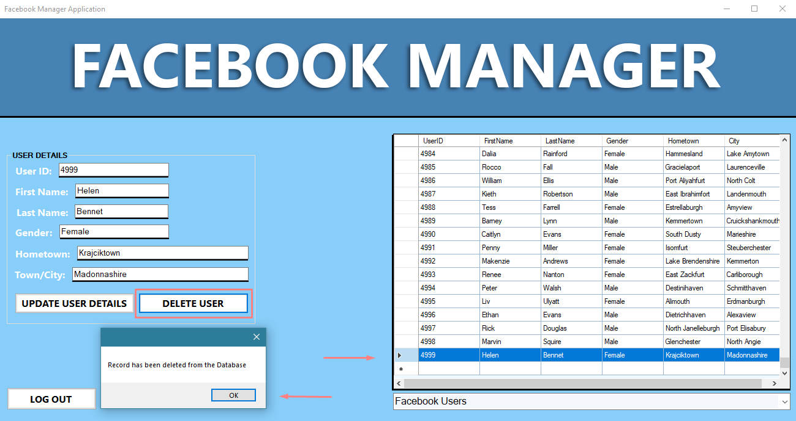

# Database Manager Application
This repository is being used in order to store my Database Application for the ISAD157 Coursework. 
The Repository will provide my Visual Studio Folder which contains my code for my Database Application,
it also provides my UML and Normalisation diagrams in a clearer format than what is displayed on my Report.
An exe for the Application is also available to test!

**UML Diagrams**
- Use Case Diagrams: Who will use the application.
- Class Diagram: The relationships between the tables in our database.
- Activity Diagram: How and what our Database Manager from the Use Case will use in the Application.
- Sequence Diagram: How our Application will function and what it will contain.
- State Diagram: The different states in which our Database Manager will go through when using the Application.

**Normalization Diagrams**
- Normalized Initial Diagram: What the initial data each of our tables will contain and what relationship they have with one another
- Normalisation Table Diagrams: A clearer look into what our Normalised Data will look like in table form
- Final Entity Relationship Diagram: The normalised diagram generated by MySql to display the relationships between our tables.

**Visual Studio Facebook Database Application:**
This repository contains the folder used in Visual Studio which provides all necessary code to make the application function

**Sample Code:**
The Sample Code used in the Application to make the Update and Delete Features Function 
can be viewed in the repository as well, this also includes the Exception Handling code also.

# How To Use The Application

**Facebook Manager Application UI**

 
 
 

**Here is a brief overview of how to naviate the UI!**

- The Yellow Arrow shows us the Data Grid View. This will display the Table Data stored in the Database!
- The Red Arrow indicates the Combo Box. This allows you to select what table displays in the Data Grid View!
- The Green Arrow shows us where the User Data will be displayed!
- The Pink Arrows indicate the Update and Delete Buttons!
- The Black Arrow indicates the Exit Button. Used to close the application!

 
 
 

In order to display users details you must select a record/row in the Datagrid and it will automatically display itself in the User Details on the left hand side!

 
 
 

To update User Data, select a user in the Facebook Users table, the data will be shown in the Text Boxes on the left,
replace the data that has been inserted in those Text Boxes and select the Update button underneath. A Message Box will
appear and inform you that the User Details have been changed!

 
 
 

To Delete a User you must select a User in the Data Grid, click the delete button and their information will
be removed from the Database.

# YOU CAN'T CHANGE THE USER ID AS IT'S BEING USED AS A PRIMARY KEY!
